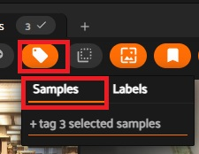
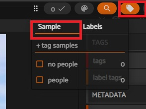

# Cleaning labels and ground truth

We are going to do a little data cleaning and prep but then load the data I finished cleaning. Given the length of the workshop, cleaning the labels would take too long to do together.
All the samples will eventually have a ground truth label of "people" or "no people"

We will start by using tags to mark missed predictions with their eventual label

This process is more interactive and so we won't be running a Python file. Instead we will be using a combination of 
the REPL and the FiftyOne Application. 

Start python in the terminal below:
```
python
```

Now handle our imports, load the data, and launch the app:

```
import fiftyone as fo
from fiftyone import ViewField as F

dataset = fo.load_dataset("predicted_labels")
session = fo.launch_app(dataset)
```

Then, in the app find a mislabeled sample and check the box in the top left corner of the picture


Let's look at how the app and your Python session are connected. Since we have a sample selected we can use the API to create a sample with the selected image:

```python
# This returns an array with the IDs of the selected images
session.selected

# We can use this instantiate that photo as a Sample
sample = dataset[session.selected[0]]
sample

# Now we can select a sample from the code and have it show up in the UI
# NOTE: UUIDs for images are not persistent between dataset loads. Each time you create the sample it will get a new 
# UUID. Therefore, this UUID will not work. Go grab another UUID from the image and paste it here
session.select_samples(["6773012fa08cade6ec7e44e1"])
# Go look in the app

# Or we can bring up a sample as the focused image
session.sample_id = "6773012fa08cade6ec7e44db"
```

There are other methods you use to select samples in the app, such as [select by sample labels](https://docs.voxel51.com/api/fiftyone.core.session.html#fiftyone.core.session.Session.select_labels) or do operations on the currently selected samples, such as add a [tag to all](https://docs.voxel51.com/api/fiftyone.core.session.html#fiftyone.core.session.Session.tag_selected_samples) the selected samples. 

### Using the App to tag and then use the API to create ground truth

#### Grid View
Now let's use the App and API together to make a ground truth field. We are only going to do a few samples but it will give you an idea of the workflow.

Find and select an image(s) where a person was predicted but there is no person, such as the image above. 

Once you have selected all the images you want, click on the tag icon in the top left menu bar above the image grid. Make sure the "Samples" section is selected.



In the line that says "+tag 3 selected samples" type in "no people" without the quotes. Hit the enter key and then click on the Apply button

#### Individual Image
You can use the same basic technique when you have a single image in the modal view. 

The time the tag icon will be on the top right. Click on it, make sure to click on the sample tab, and then either add a new tag or choose an existing tag and then click apply



When we are all done tagging errors, we would have run this code to set up the Ground Truth labels.
In FiftyOne, if you create a field titled "ground_truth" that holds Classification labels with a label field equal to the class, 
the platform has built in conveniences to handle the field. It "knows" what this field is for and how to use it. 

#### Code to build ground truth and use our tagging

The logic is:
1. If there is a tag - that is going to be the label for the ground_truth field
2. If there is a no tag but there "without any people" label for the prediction field then set ground_truth label = "no people"
3. Everything else get's a ground_truth label of "people"

```Python
if dataset.has_field("ground_truth"):
    dataset.delete_sample_field("ground_truth")
# Must initialize new `Label` values via `set_values()`
# This basically creates a Classification for each sample in the data set which just contains an id
dataset.set_values(
    "ground_truth",
    [fo.Classification() for _ in range(len(dataset))],
)


label_expr = (
    F("$tags").switch(
        {
            ( F() != []): F("$tags")[0],
            ( F("$prediction.label") == "without any people"): "no people",
        },
	    default="people"
    )
)

dataset.set_field("ground_truth.label", label_expr).save()

```

If you want to see the final dataset it is available on [HuggingFace](https://huggingface.co/datasets/Voxel51/getting-started-labeled-photos). 

It is simple to load and visualize here:

```Python

from fiftyone.utils.huggingface import load_from_hub

final_dataset = load_from_hub("Voxel51/getting-started-labeled-photos", persistent=True, name="training_data")

session.dataset = final_dataset

```

I also used a similar to technique to provide ground truth to our validation set. This will be helpful when we go to evaluate model effectiveness. It is also in HuggingFace but we will load it when we go to evaluate our models. 

Time to fine tune a model
